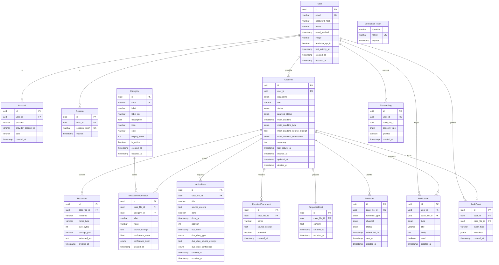

# Schéma de Base de Données — CapClair

> Les schémas sont définis avec **Prisma** (schema-first, type-safe). L'authentification suit le schéma
> d'**Auth.js** via l'adaptateur Prisma. Les migrations sont gérées par **Prisma Migrate**
> (`prisma migrate dev` / `prisma migrate deploy`). La validation des données entrantes — et surtout de
> la sortie de l'IA — utilise **Zod**.
>
> **Une seule base PostgreSQL**, organisée en domaines logiques (monolithe modulaire, pas de
> microservices). Le fichier source du diagramme est `erd-capclair.mermaid`.

## Diagramme Entité-Relation



## Organisation par domaine

### Authentification (schéma Auth.js)

> Tables du modèle d'Auth.js (adaptateur Prisma). La connexion e-mail/mot de passe stocke le
> `password_hash` sur `User`. Deux champs métier sont greffés sur `User` : `reminder_opt_in`
> (interrupteur global des rappels, coupe C7) et `last_activity_at` (pilote la purge à 12 mois, D12).


| Table               | Description                                                            | Volumétrie estimée |
| --------------------- | ------------------------------------------------------------------------ | ---------------------- |
| `User`              | Compte utilisateur (e-mail, mot de passe haché, préférence rappels) | ~50                  |
| `Account`           | Comptes liés (credentials, OAuth éventuel)                           | ~50                  |
| `Session`           | Sessions actives                                                       | ~150                 |
| `VerificationToken` | Jetons de vérification e-mail / réinitialisation                     | ~20                  |

### Domaine — Identité & dossier


| Table      | Description                                                                                          | Volumétrie estimée |
| ------------ | ------------------------------------------------------------------------------------------------------ | ---------------------- |
| `CaseFile` | Dossier = un courrier suivi : organisme, statut métier (4), statut d'analyse, échéance principale | ~500                 |
| `Document` | Fichier PDF importé + texte extrait (barrière < 100 caractères avant IA)                          | ~600                 |

### Domaine — Analyse


| Table                  | Description                                                                                                               | Volumétrie estimée |
| ------------------------ | --------------------------------------------------------------------------------------------------------------------------- | ---------------------- |
| `Category`             | Référentiel des catégories d'information (code stable seedé + métadonnées : libellé, i18n, icône, couleur, ordre) | 6 (seed)             |
| `ExtractedInformation` | Information extraite du courrier, avec extrait source et niveau de confiance                                              | ~3 000               |
| `ActionItem`           | Action à faire, cochable, avec échéance calculée serveur et extrait source                                            | ~1 000               |
| `RequiredDocument`     | Justificatif à fournir, cochable, avec extrait source                                                                    | ~800                 |
| `ResponseDraft`        | Brouillon de réponse (1 par dossier), zones à compléter explicites                                                     | ~400                 |

### Domaine — Rappels & notifications


| Table          | Description                                                                             | Volumétrie estimée |
| ---------------- | ----------------------------------------------------------------------------------------- | ---------------------- |
| `Reminder`     | Rappel planifié avant échéance ; unicité (dossier, type, canal) contre les doublons | ~1 500               |
| `Notification` | Notification interne (analyse terminée/échec, rappel, système), état lu/non lu      | ~2 000               |

### Domaine — Conformité & audit


| Table        | Description                                                                                                                                                           | Volumétrie estimée |
| -------------- | ----------------------------------------------------------------------------------------------------------------------------------------------------------------------- | ---------------------- |
| `ConsentLog` | Trace**immuable** du consentement explicite avant appel IA (US-3.1) et acceptation des CGU                                                                            | ~600                 |
| `AuditEvent` | Journal**append-only** des événements (jamais de contenu sensible, US-8.2) ; alimenté au fil des sprints même si l'écran d'historique est reporté (réserve C9) | ~10 000              |

## Énumérations


| Enum               | Valeurs                                          | Décision                               |
| -------------------- | -------------------------------------------------- | ----------------------------------------- |
| `Organisme`        | CAF, CPAM, FRANCE_TRAVAIL                        | —                                      |
| `CaseStatus`       | A_ANALYSER, A_FAIRE, EN_ATTENTE_REPONSE, TERMINE | **D9** (réduit de 6 à 4 après tests) |
| `AnalysisStatus`   | EN_ATTENTE, EN_COURS, TERMINEE, ECHEC            | **D8** (analyse asynchrone)             |
| `ConfidenceLevel`  | FAIBLE, MOYEN, ELEVE                             | **D10** (seul FAIBLE mis en avant)      |
| `EcheanceType`     | EXPLICITE, RELATIVE                              | **D7** (relative = calculée serveur)   |
| `ReminderType`     | J_MOINS_7, J_MOINS_1, JOUR_J                     | —                                      |
| `ReminderChannel`  | EMAIL, IN_APP                                    | —                                      |
| `ReminderStatus`   | EN_ATTENTE, ENVOYE, ANNULE                       | transition atomique (US-7.3)            |
| `NotificationType` | ANALYSE_TERMINEE, ANALYSE_ECHEC, RAPPEL, SYSTEME | —                                      |
| `ConsentType`      | ANALYSE_IA, CGU                                  | US-3.1                                  |

> `Category.code` reprend l'ensemble fermé qui était initialement un enum (D14) : REFERENCE, MONTANT,
> DATE, IDENTITE, CONTACT, AUTRE. Il est désormais porté par une table de référence **seedée** (valeurs
> figées via migration) pour permettre des métadonnées riches, tout en conservant la garantie de
> cohérence de D14 au niveau applicatif.

## Règles d'intégrité référentielle


| Relation                                                                                                        | À la suppression du parent | Justification                                                              |
| ----------------------------------------------------------------------------------------------------------------- | ----------------------------- | ---------------------------------------------------------------------------- |
| `User` → `Account`, `Session`, `CaseFile`                                                                      | **CASCADE**                 | Suppression de compte = suppression des données liées (RGPD)             |
| `CaseFile` → `Document`, `ExtractedInformation`, `ActionItem`, `RequiredDocument`, `ResponseDraft`, `Reminder` | **CASCADE**                 | Le contenu d'un dossier n'a pas de sens sans le dossier                    |
| `CaseFile` → `Notification`                                                                                    | **SET NULL**                | On conserve la notification dans l'historique utilisateur, on perd le lien |
| `User` / `CaseFile` → `ConsentLog`                                                                             | **SET NULL**                | Trace de preuve conservée (anonymisée) même après suppression          |
| `User` / `CaseFile` → `AuditEvent`                                                                             | **SET NULL**                | Journal d'audit conservé même après suppression de l'entité liée      |
| `Category` → `ExtractedInformation`                                                                            | **RESTRICT**                | Une catégorie référencée ne peut pas être supprimée                  |

### Contraintes d'unicité

- `User.email` — unique.
- `Session.session_token`, `VerificationToken.token` — uniques.
- `Category.code` — unique (clé stable du référentiel).
- `ResponseDraft.case_file_id` — unique (**un seul brouillon par dossier**).
- `Reminder (case_file_id, reminder_type, channel)` — **unique composite** : au plus un rappel par
  dossier, type et canal. Avec la transition atomique `EN_ATTENTE → ENVOYE`, c'est le garde-fou
  anti-doublon (US-7.3).

## Index recommandés

```sql
-- Identité & dossier
CREATE INDEX idx_user_last_activity      ON "User"(last_activity_at);        -- purge 12 mois
CREATE INDEX idx_casefile_user           ON "CaseFile"(user_id);
CREATE INDEX idx_casefile_status         ON "CaseFile"(status);
CREATE INDEX idx_casefile_analysis       ON "CaseFile"(analysis_status);
CREATE INDEX idx_document_casefile       ON "Document"(case_file_id);

-- Analyse
CREATE INDEX idx_extracted_casefile      ON "ExtractedInformation"(case_file_id);
CREATE INDEX idx_extracted_category      ON "ExtractedInformation"(category_id);
CREATE INDEX idx_action_casefile         ON "ActionItem"(case_file_id);
CREATE INDEX idx_required_casefile       ON "RequiredDocument"(case_file_id);

-- Rappels & notifications
CREATE INDEX idx_reminder_due            ON "Reminder"(status, scheduled_for);  -- balayage du worker
CREATE INDEX idx_notification_user_read  ON "Notification"(user_id, read);

-- Conformité & audit
CREATE INDEX idx_consent_user            ON "ConsentLog"(user_id);
CREATE INDEX idx_audit_casefile          ON "AuditEvent"(case_file_id);
CREATE INDEX idx_audit_user              ON "AuditEvent"(user_id);
```

## Décisions de conception reflétées dans le schéma

- **D7 — dates calculées serveur** : `main_deadline` / `due_date` sont des `timestamp` calculés par le
  serveur ; l'IA ne fournit que le `*_source_excerpt`. Une date n'est jamais produite par l'IA.
- **D8 — analyse asynchrone** : `CaseFile.analysis_status` porte l'état du job (worker BullMQ).
- **D9 — quatre statuts** : `CaseStatus` réduit de six à quatre après tests utilisateurs.
- **D10 — confiance** : `confidence_score` stocké mais jamais affiché brut ; `confidence_level` (3
  niveaux) sur les infos **et** sur les échéances, pour alimenter le signal « À vérifier ».
- **D12 — conservation 12 mois** : `User.last_activity_at` + tâche planifiée de purge.
- **D14 — catégories** : ensemble fermé porté par `Category.code` (référentiel seedé).
- **I-8 — brouillon** : `ResponseDraft.content` ne contient aucune affirmation absente du dossier ;
  zones à compléter explicites.
- **US-8.2 — journalisation** : `AuditEvent.metadata` (JSONB) ne contient jamais de contenu sensible.

## Prochaine étape

Le modèle est traduit dans `07-developpement/db/prisma/schema.prisma` — 15 modèles et 10 enums, table
`Category` et champs de confiance des échéances compris. Le schéma passe `prisma validate` (CLI 7.9.1).

Reste à créer la base sur **Supabase** ou en local via **pgAdmin** / Docker, puis à générer la première
migration : c'est la seule étape qui exige une base réellement joignable. Les conventions Prisma 7
(URL de connexion hors du schéma, chargement explicite de `.env`) sont documentées dans
`07-developpement/README.md`.
